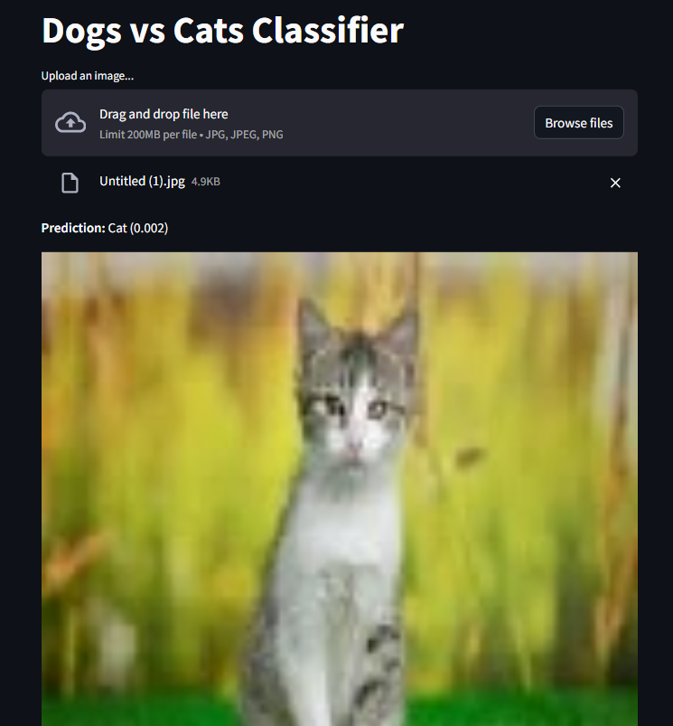
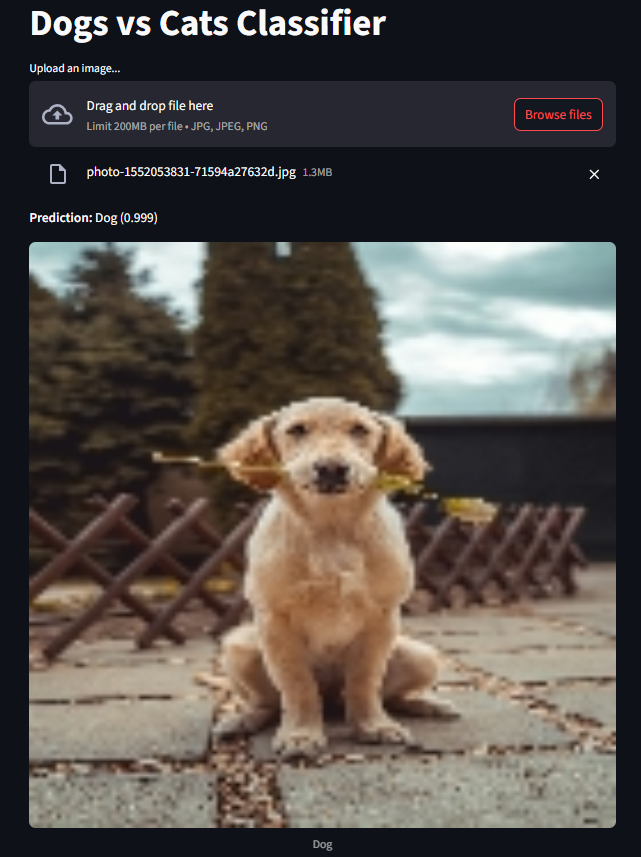

 # Dog vs Cat Classification 
---
## Live Demo 
Try it out live here: 
[**Streamlit App**](https://abhisumat-dog-vs-cat-classification.streamlit.app/)
---
## Demo Screenshots

---
Kaggle Dataset used - https://www.kaggle.com/datasets/bhavikjikadara/dog-and-cat-classification-dataset
--- 
## Table of Contents 
1. [What It Does](#what-it-does)  
2. [How It Works](#how-it-works)  
3. [Quickstart](#quickstart)   
4. [Model & Performance](#model--performance)  
5. [Contributing](#contributing)  
6. [Credits](#credits)  
7. [License & Disclaimer](#license--disclaimer)
---
## What It Does 
- Classifies images as **Dog** or **Cat** with a custom CNN model.
